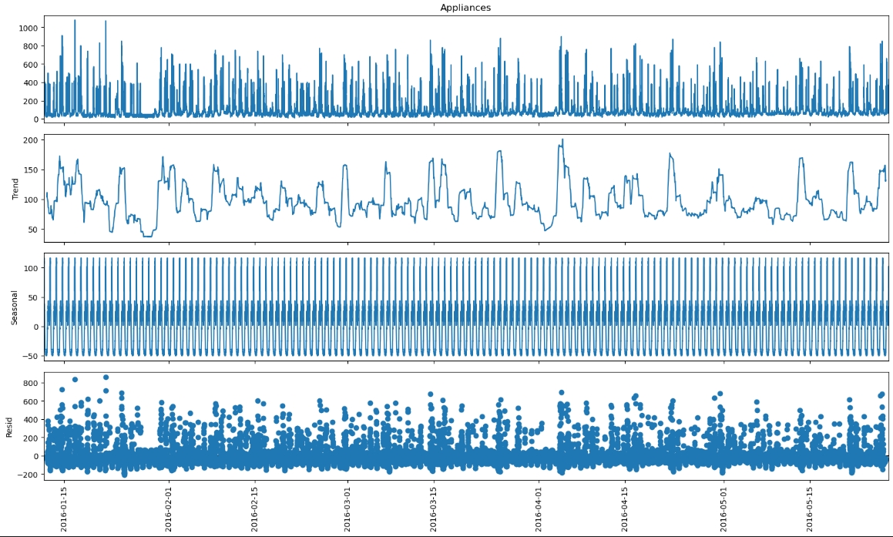
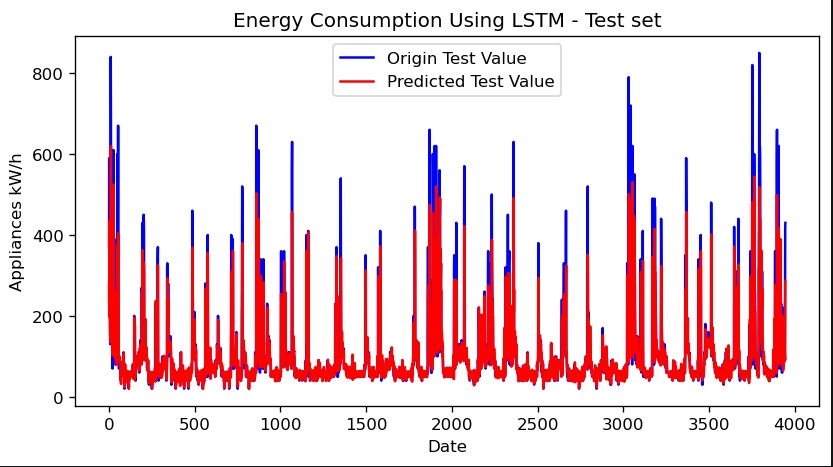

# Energy Consumption Analytics & Forecasting

## Overview

This project explores household energy consumption using two complementary analytical approaches:

1. Multivariate machine-learning models using environmental and household sensor data.
2. Time-series forecasting using historical energy-consumption patterns.

The project demonstrates an end-to-end Python workflow including data preparation, exploratory analysis, model development, model comparison, hyperparameter tuning and forecasting.

## Project Objectives

The analysis aims to answer two main questions:

- Which environmental and household factors are useful for predicting appliance energy consumption?
- Can historical energy-use patterns be used to forecast future consumption?

## Part 1 — Energy Usage Prediction

The first analysis uses household and environmental variables to predict appliance energy consumption.

The workflow includes:

- Data cleaning and validation
- Exploratory data analysis and visualisation
- Feature preparation and scaling
- Linear Regression
- Random Forest Regression
- Gradient Boosting Regression
- Cross-validation and hyperparameter tuning
- Model evaluation using RMSE, MAE and R²
- Feature-importance analysis

Random Forest and Gradient Boosting provided stronger predictive performance than the linear baseline, indicating that energy consumption contains important non-linear relationships.


## Part 2 — Time Series Forecasting

The second analysis focuses on the temporal behaviour of appliance energy consumption.

Time-series exploration identified strong recurring daily patterns in energy use. ARIMA and LSTM models were developed and evaluated to investigate how effectively historical consumption can be used for forecasting.

The LSTM model produced the strongest overall forecasting performance among the tested models, while ARIMA had difficulty capturing some of the larger fluctuations in energy demand.





## Technologies

Python  
Pandas  
NumPy  
Matplotlib / Seaborn  
scikit-learn  
statsmodels  
TensorFlow / Keras

## Repository Structure

```text
notebooks/
    01_energy_usage_prediction.ipynb
    02_energy_time_series_forecasting.ipynb

images/
    feature_importance.png
    seasonal_decomposition.png
    lstm_forecast.png

README.md
requirements.txt

## Key Learning Outcomes  

This project strengthened my practical experience in:  

- analysing complex multivariable datasets;
- selecting appropriate analytical approaches based on data characteristics;
- comparing machine-learning and time-series methods;
- evaluating model performance critically rather than relying on a single metric;
- translating modelling results into practical analytical conclusions.

## Future Improvements  

Potential extensions include further feature engineering, more systematic hyperparameter optimisation, comparison with additional forecasting methods such as SARIMA, and improvements to model interpretability and computational efficiency.
