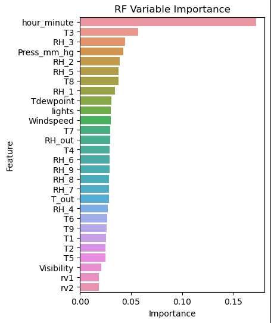
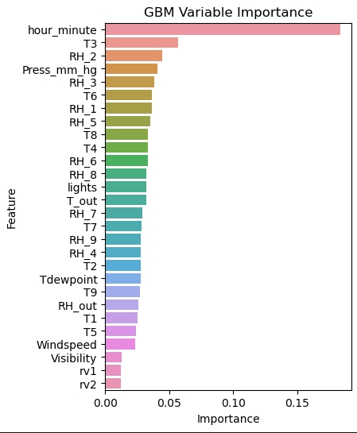

# Energy Consumption Analytics & Forecasting

## Overview

This project analyses household appliance energy consumption using two complementary approaches:

1. **Machine-learning regression**, using household and environmental variables to predict energy usage.
2. **Time-series forecasting**, using historical consumption patterns to forecast future energy demand.

The project demonstrates an end-to-end Python workflow covering data preparation, exploratory analysis, feature analysis, model development, hyperparameter tuning, time-series decomposition and forecasting.

---

## Project Objectives

The analysis focuses on two questions:

- Which household and environmental variables are most useful for predicting appliance energy consumption?
- Can historical energy-consumption patterns be used to forecast future demand?

---

## Part 1 — Energy Usage Prediction

The first analysis uses household sensor, environmental and time-related variables to predict appliance energy consumption.

The workflow includes:

- Data cleaning and validation
- Exploratory data analysis
- Feature preparation and scaling
- Linear Regression
- Random Forest Regression
- Gradient Boosting Regression
- Cross-validation and hyperparameter tuning
- Model evaluation using RMSE, MAE and R²
- Feature-importance analysis

Random Forest and Gradient Boosting both captured non-linear relationships in the data more effectively than the linear baseline. Feature-importance analysis also showed that **time of day (`hour_minute`) was the most influential predictor in both models**, suggesting that energy consumption has a strong temporal component.

### Feature Importance

<p align="center">
  
  
</p>

The importance of time-related features motivated the second part of the project, where energy consumption was analysed directly as a time series.

---

## Part 2 — Time Series Forecasting

The second analysis focuses on the temporal behaviour of appliance energy consumption.

Time-series decomposition was used to separate the observed data into trend, seasonal and residual components. The results showed a strong recurring daily pattern in energy use, supporting the use of time-series forecasting methods. :contentReference[oaicite:0]{index=0}

### Seasonal Structure

<p align="center">
  
</p>

ARIMA and LSTM models were then developed to forecast future appliance energy consumption.

The ARIMA model captured parts of the overall pattern but had difficulty representing larger fluctuations and peak demand. :contentReference[oaicite:1]{index=1}

The LSTM model achieved the strongest overall forecasting performance among the tested approaches based on the evaluation metrics used in the project. :contentReference[oaicite:2]{index=2}

### LSTM Forecast

<p align="center">
  
</p>

The forecast follows the overall consumption pattern reasonably well, although some extreme peaks remain difficult to predict.

---

## Key Findings

- Household energy consumption shows strong **non-linear and time-dependent behaviour**.
- Time of day was the most influential feature in both Random Forest and Gradient Boosting models.
- Feature importance from the regression models suggested that temporal patterns deserved further investigation.
- Time-series decomposition confirmed a strong recurring daily pattern in appliance energy usage.
- LSTM performed better than the other tested approaches for forecasting this highly variable time series.
- Model selection should consider both predictive accuracy and the underlying structure of the data rather than relying on a single modelling approach.

---

## Technologies

- **Python**
- **Pandas**
- **NumPy**
- **Matplotlib / Seaborn**
- **scikit-learn**
- **statsmodels**
- **TensorFlow / Keras**

---

## Repository Structure

```text
energy-consumption-analytics-forecasting/
│
├── README.md
├── requirements.txt
│
├── notebooks/
│   ├── 01_energy_usage_prediction.ipynb
│   └── 02_energy_time_series_forecasting.ipynb
│
└── images/
    ├── rf_feature_importance.png
    ├── gbm_feature_importance.png
    ├── seasonal_decomposition.png
    └── lstm_forecast.png
